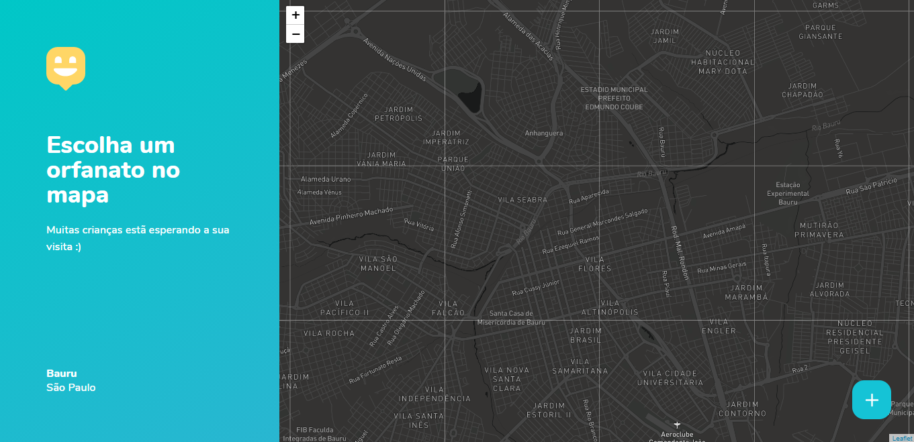

<h1 align="center">Happy</h1>

<p align="center">Faça uma visita para crianças em orfanetos, pequenos gestos geram grandes alegrias!</p>

<h4 align="center"> 
	🚧  Em construção...  🚧
</h4>
<p align="center">Em breve mais funções estarão disponiveis!!</p>

<p align="center">
 <a href="#-sobre">Sobre</a> •
 <a href="#-layout">Layout</a> • 
 <a href="#-executando-o-happy">Como executar</a> • 
 <a href="#-tecnologias">Tecnologias</a> • 
 <a href="#-como-contribuir">Como contribuir</a> • 
 <a href="#-licença">Licença</a> 
</p>

---

## 💡 Sobre

A aplicação permite a comunidade se aproximar das crianças em orfanatos da cidade de Bauru-SP, é possivel adicionar novos orfanatos, agendar visitas e tirar dúvidas sobre o que levar na visita.

Projeto construido durante a 3a NLW da [Rocketseat](https://rocketseat.com.br/).

---

## 🎨 Layout


### Web

<p align="center">
  

  
</p>

---

## 💻 Executando o Happy

### Pré-requisitos

É necessário ter instalado na sua máquina para execução desse projeto:
- <a href="https://nodejs.org/en/"> NodeJS </a>;
- Gerenciador de pacotes Npm(já vem com o NodeJS) ou <a href="https://yarnpkg.com/getting-started/install"> Yarn </a>;
- <a href="https://pt-br.reactjs.org/"> React </a>;


### ♊ Clonando o Repositório

```bash

$ git clone https://github.com/heyloh/happy.git

# entre na pasta do projeto

$ cd happy

```
### 💻 Executando projeto web

Entre na pasta

```bash

$ cd web

```
Instale as dependências

```bash

$ yarn install

# ou, caso use npm

$ npm install

```

Rode a aplicação

```bash

$ yarn start

# ou, caso use npm

$ npm start

```

### 🌐 Executando o servidor do projeto

> Em breve...

### 📱 Executando o projeto mobile 

> Em breve...


---

## 🗺 Mapbox

Para utilizar  o mapbox siga as intruções abaixo.

- Em "https://account.mapbox.com/", crie uma conta(é de graça) e copie seu token.
- Na raiz do projeto web crie um arquivo chamado ".env"

---

## 🛠️ Tecnologias

Principais tecnologias utilizadas no desenvolvimento do projeto.

#### Backend:
> Em breve...

#### Web:
- Typescript
- ReactJS ⚛️
- React Router Dom
- React Icons
- Leaflet 🍃
- API do Mapbox 🗺️

#### Mobile:
> Em breve...

---

## ⚙️ Como contribuir

- Faça um fork desse repositório;
- Crie uma branch com a sua feature: `git checkout -b minha-feature`;
- Faça commit das suas alterações: `git commit -m 'feat: Minha nova feature'`;
- Faça push para a sua branch: `git push origin minha-feature`.

---

## 📝 Licença

Este projeto está sob licença [MIT](./LICENSE).

<p>Feito com 💙 por <a href="https://www.linkedin.com/in/silviodiasjr/">Silvio Dias</a></p>

